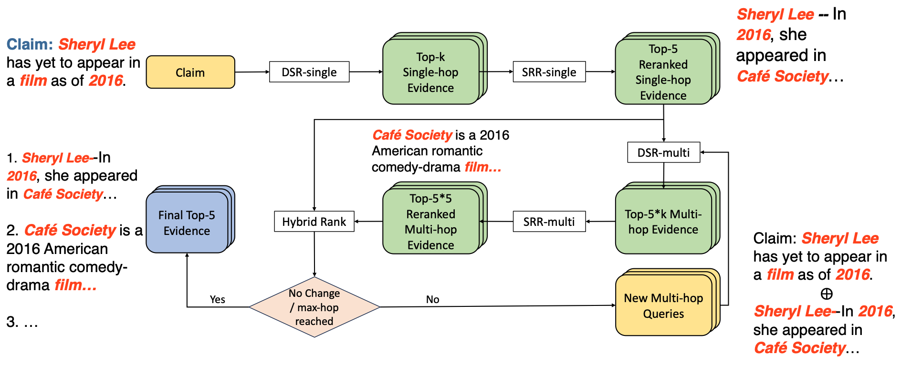

# M3: A Multi-Hop Dense Sentence Retrieval System for Fact Checking

Yang Bai, Anthony Colas, Christan Grant, Daisy Zhe Wang<br>
University of Florida <br>

M3 is an advanced multi-hop dense sentence retrieval system for automatic fact checking. The repo provides code and pretrained retrieval models that produce **state-of-the-art** retrieval performance on the [FEVER fact extraction and verification dataset](https://codalab.lisn.upsaclay.fr/competitions/7308). 

More details about our approach are described in our COLING paper [M3: A Multi-Task Mixed-Objective Learning Framework for Open-Domain Multi-Hop Dense Sentence Retrieval ](https://aclanthology.org/2024.lrec-main.947/)

<p align="center"></p>

- [1.0 Set up the environment](#10-set-up-the-environment)
- [2.0 Download the necessary data files and pretrained retrieval models](#20-download-the-necessary-data-files-and-pretrained-retrieval-models)
    - [2.1 Data folder structure](#21-data-folder-structure)
- [3.0 Train and Evaluate M3-DSR](#30-train-and-evaluate-m3-dsr)
    - [3.1 Process data for dense retrieval](#31-process-data-for-dense-retrieval)
        - [3.1.1 FEVER Wiki page to Wiki sentence](#311-fever-wiki-page-to-wiki-sentence)
        - [3.1.2 Transform FEVER Wiki sentence corpus in pyserini format](#312-transform-fever-wiki-sentence-corpus-in-pyserini-format)
        - [3.1.3 Build sparse index using BM25 and FAISS for negative sampling](#313-build-sparse-index-using-bm25-and-faiss-for-negative-sampling)
        - [3.1.4 Negative sampling using BM25](#314-negative-sampling-using-bm25)
        - [3.1.5 Further clean hard negatives](#315-Further-clean-harge-negatives)
    - [3.2 Train M3-DSR](#32-train-m3-dsr)
    - [3.3 Evaluate M3-DSR](#33-evaluate-m3-dsr)
        - [3.3.1 Build dense index using trained M3-DSR with FAISS framework](#331-Build-dense-index-using-trained-M3-DSR-with-FAISS-framwork)
        - [3.3.2 Search for evidence for each claim using the dense index and M3-DSR (dense sentence retriever)](#332-search-for-evidence-for-each-claim-using-the-dense-index-and-m3-dsrdense-sentence-retriever)
        - [3.3.3 Evaluate the retrieval accuracy](#333-Evluate-the-retrivel-accuracy)
- [4.0 Train and Evaluate M3-SRR (sentence reranker)](#40-train-and-evaluate-m3-srrsentence-reranker)
    - [4.1 Build training dataset for M3-SRR](#41-build-training-dataset-for-m3-srr)
    - [4.2 Train M3-SRR](#42-train-m3-srr)
    - [4.3 Evaluate M3-SRR](#43-evaluate-m3-srr)
- [5.0 Multi-hop Reranking Eval](#50-multi-hop-reranking-eval)
- [6.0 Hybrid Ranking](#60-Hrbrid-Ranking)
- [7.0 Train and Evaluate Claim Verdict Classifier](#70-train-and-evaluate-claim-verdict-classifier)
    - [7.1 Build training dataset for claim verdict classifier](#71-build-training-dataset-for-claim-verdict-classifier)
    - [7.2 Train claim verdict classifier](#72-train-claim-verdict-classifier)
    - [7.3 Evaluate claim verdict classifier](#73-evaluate-claim-verdict-classifier)
- [8.0 Optimize claim verdict classification with XGBoost](#80-Otpimize-claim-verdict-classificaition-with-xgboost)
    - [8.1 Train boosted claim verdict classifier](#81-train-boosted-claim-verdict-classifier)
    - [8.2 Evaluate boosted claim verdict classifier](#82-Eval-boosted-claim-verdict-classifier)


## 1.0 Set up the environment

1. Set up the environment

Requirement: python >= 3.10, Java >= 21.0

```bash
conda create --name M3 python=3.10
conda activate M3
git clone https://github.com/TonyBY/M3.git
cd M3 
pip install -r requirements.txt
```


## 2.0 Download the necessary data files and pretrained retrieval models
```bash
bash ./download_data.sh
```


### 2.1 data folder structure
```
M3/data/
└───FEVER_1
│   │ train.jsonl
│   │ shared_task_dev.jsonl
│   │ shared_task_test.jsonl
│   │
│   └───wiki-pages
│        │wiki-001.jsonl
│        │wiki-002.jsonl
│        │...
│        │wiki-109.jsonl
│        
└───pyserini
│   └───wiki_sent_dict
│   └───processed_corp
│   └───index
│ 
└───checkpoints
│ 
└───reults
│   └───intermediate_results
│   │   └───rerank
│   │   └───srr-m_results
│   │   └───merged_results
│   │   └───claim_classification
│   │   └───final_eval
│   └───intermediate_datasets
│   │   └───rerank
│   │   └───claim_classification
│   └───trained_models
│   │   └───rerank
│   │   └───claim_classification
│   │   └───xgboost_classification
│   └───data_construction
│   └───zero-shot
│       └───bm25
│       └───dpr
│ 
└───M3_dsr_training
    └───singleHop
    │    │FeverSingleHopAndNEI_dev_19998.jsonl
    │    │FeverSingleHopAndNEI_train_145442.jsonl
    │
    └───twpHop
         │FeverTwoHopAndNEI_dev_11346.jsonl
         │FeverTwoHopAndNEI_train_87460.jsonl
```

## 3.0 Train and Evaluate M3-DSR
### 3.1 Process data for dense retrieval.
#### 3.1.1 FEVER Wiki page to Wiki sentence.
``` bash
python M3/src/data/get_raw_wiki_sent_dicts.py
```

* Input: a path to wiki-pages folder, M3/data/FEVER_1/wiki-pages, where saves ~5M wiki documents in 109 .jsonl files.
* Output: M3/data/pyserini/wiki_line_dict/fever_wiki_line_dict.pkl, a map between global sentence ids to sentence line.
example data: {'Mascot_Books|#SEP#|0', 'Mascot Books is a full-service , multi-genre , independent book publisher and distributor .'}

#### 3.1.2 Transform FEVER Wiki sentence corpus in pyserini format.
```bash
python M3/src/data/process_wiki_sent_corpus.py
```

* Input:  M3/data/pyserini/wiki_line_dict/fever_wiki_line_dict.pkl, a map between global sentence ids to sentence line.
* Ouput: M3/data/pyserini/processed_corpus/processed.jsonl, a list of processed sentence of format: {"id": str, "context": str}

#### 3.1.3 Build sparse index using BM25 and FAISS for negative sampling.
```bash
python M3/src/data/pyserini_indexer.py
```

* Input: A list of processed sentence of format: {"id": str, "context": str} at 'M3/data/pyserini/processed_corpus/processed.jsonl'.
* Output: A folder, 'M3/data/pyserini/index/sparse_bm25', contains an index file for efficient searching using BM25.
* Note: Make user you have Java >= 21.0 installed in your system.

#### 3.1.4 negative sampling using BM25.
```bash
python M3/src/data/fever_to_dpr.py \
    --data_path  ${data_path}\
    --index_dir ${index_dir} \
    --wikiSentence_path ${wikiSentence_path} \
    --cache_path ${cache_path} \
    --is_training_data True \
    --num_hard_negatives 50 \
    --multihop_mode False
```

* Input: 
    1. data_path='M3/data/FEVER_1/shared_task_dev.jsonl'. 
    2. index_dir='M3/data/pyserini/index/sparse_bm25'
    3. wikiSentence_path='M3/data/pyserini/wiki_line_dict/fever_wiki_line_dict.pkl'. 
    4. cache_path='M3/data/M3_dsr_training/m3_dsr_train_bm25.jsonl'
    4. Other parameters.
* Output: Data in DPR format with query as the claim, answer as the claim verdict, positive sentence-level evidence, sentence-level hard-negatives sampled by bm25, saved at 'M3/data/M3_dsr_training/m3_dsr_train_bm25.jsonl'.
* Note: Make sure to process for both dev and training data.

#### 3.1.5 Further clean harge negatives.
```bash
python M3/src/data/clean_negs.py \
                     --data_path ${data_path} \
                     --neg_size 50 \
                     --device cuda \
                     --model_name ${model_name} \
                     --threshold 0.999 \
                     --max_len 512
```

* Input:  
    1. data_path='M3/data/M3_dsr_training/m3_dsr_train_bm25.jsonl', data in DPR format with query as the claim, answer as the claim verdict, positive sentence-level evidence, sentence-level hard-negatives sampled by bm25.
    2. model_name='cross-encoder/ms-marco-MiniLM-L-12-v2', a pretrained model for zero-shot false-negtive filtering.
* Output: M3/data/M3_dsr_training/clean_neg_m3_dsr_train_bm25.jsonl, data in DPR format with fine-grained hard-negatives by more complex pre-trained language model through point-wise ranking.
* Note: Make sure to process for both dev and training data.

### 3.2 Train M3-DSR.
```bash
python M3/src/train_dsr.py \
    --single_encoder False \
    --do_train True \
    --train_mode JOINT \
    --init_checkpoint False \
    --checkpoint_path '' \
    --prefix train_dsr_JOINT \
    --no_cuda False \
    --query_encoder_name ${query_encoder_name} \
    --ctx_encoder_name ${ctx_encoder_name} \
    --num_workers 16 \
    --train_batch_size 512 \
    --predict_batch_size 1024 \
    --accumulate_gradients 1 \
    --gradient_accumulation_steps 1 \
    --num_train_epochs 20 \
    --learning_rate 3e-6 \
    --train_file ${TRAIN_DATA_PATH} \
    --development_file ${DEV_DATA_PATH}  \
    --num_hard_negs 2 \
    --output_dir ${output_dir} \
    --seed 16 \
    --eval_period 500 \
    --max_seq_len 256 \
    --warmup_ratio 0.1 \
    --use_extra_retrieve_only_train_dataset True \
    --extra_retrieve_only_train_file ${DPR_MULTI_DATA_PATH} \
    --weighted_sampling True \
    --use_weighted_ce_loss True \
    --mix_interval 2 \
    --retrieval_to_nli_weight 30 \
    --target_nli_distribution "1 1 1" \
    --use_joint_best_score False \
    --use_nli_best_score False \
    --temp 2.0 \
    --sim_type dot \
    --use_ce_loss True
```

* Input: 
    1. query_encoder_name='facebook/dpr-question_encoder-multiset-base'; 
    2. ctx_encoder_name='facebook/dpr-ctx_encoder-multiset-base';
    3. TRAIN_DATA_PATH='M3/data/M3_dsr_training/clean_neg_m3_dsr_train_bm25.jsonl'; 
    4. DEV_DATA_PATH='M3/data/M3_dsr_training/clean_neg_m3_dsr_dev_bm25.jsonl'; 
    5. DPR_MULTI_DATA_PATH="M3/data/M3_dsr_training/DPR_noSquad.jsonl", dataset that used to train the [DPR model](https://github.com/facebookresearch/DPR), we remove the SQUAD portion of data for better training performance.
* Output: Two trained sentence sencoders for dense retrieval. One for claim(query) encoding, the other for evidence(ctx) encoding, which are saved at output_dir="M3/data/checkpoints".

### 3.3 Evaluate M3-DSR.
#### 3.3.1 Build dense index using trained M3-DSR with FAISS framwork.
```bash
python M3/src/index/indexer.py \
    --single_encoder False \
    --checkpoint_path ${checkpoint_path} \
    --query_encoder_name ${query_encoder_name} \
    --ctx_encoder_name ${ctx_encoder_name} \
    --index_type IndexFlatIP \
    --encoding_batch_size 2048 \
    --indexing_batch_size 50000 \
    --index_dir ${index_dir} \
    --sentence_corpus_path ${sentence_corpus_path} \
    --encode_only False
```

* Input: 
    1. checkpoint_path='M3/data/checkpoints/<DATE>/<run_name>/checkpoint_best.pt'
    2. query_encoder_name='facebook/dpr-question_encoder-multiset-base'; 
    3. ctx_encoder_name='facebook/dpr-ctx_encoder-multiset-base';
    4. index_dir='M3/data/checkpoints/<DATE>/<run_name>/index'
    5. sentence_corpus_path='M3/data/pyserini/processed_corpus/processed.jsonl'
* Output: a faiss file of the sentence corpus index, 'M3/data/checkpoints/<DATE>/<run_name>/index/IndexFlatIP_index'

#### 3.3.2 Search for evidence for each claim using the dense index and M3-DSR(dense sentence retriever).
```bash
python M3/src/IR/searcher.py \
    --single_encoder False \
    --checkpoint_path ${checkpoint_path} \
    --query_encoder_name ${query_encoder_name} \
    --ctx_encoder_name ${ctx_encoder_name} \
    --index_dir ${index_dir} \
    --index_type IndexFlatIP \
    --index_in_gpu True \
    --topk 200 \
    --query_batch_size 4 \
    --data_path ${data_path} \
    --max_num_process 1 \
    --cache_searching_result False \
    --multi_hop_dense_retrieval False \
    --debug False
```

* Input: 
    1. checkpoint_path='M3/data/checkpoints/<DATE>/<run_name>/checkpoint_best.pt'
    2. query_encoder_name='facebook/dpr-question_encoder-multiset-base'; 
    3. ctx_encoder_name='facebook/dpr-ctx_encoder-multiset-base';
    4. index_dir='M3/data/checkpoints/<DATE>/<run_name>/index'; 
    5. data_path='M3/data/FEVER_1/shared_task_dev.jsonl'; FEVER data to evaluate.
* Output: Retrieval result saved at: 'M3/data/checkpoints/<DATE>/<run_name>/search_results/shared_task_dev_single<single_encoder>_dsrmTop<topk>.jsonl'.

#### 3.3.3 Evluate the retrivel accuracy.
```bash
python ir_evaluator.py \
    --retrieval_result_path ${retrieval_result_path} \
    --debug False \
    --singleHopNumbers 5
```

* Input: retrieval_result_path='M3/data/checkpoints/<DATE>/<run_name>/search_results/shared_task_dev_single<single_encoder>_dsrmTop<topk>.jsonl'
* Output: Retreival recall@k scores. Scores are saved in a log file.

## 4.0 Train and Evaluate M3-SRR(sentence reranker)
### 4.1 Build training dataset for M3-SRR.
```bash
python M3/src/data/construct_dataset_for_reranker_trainining.py \
                --first_hop_search_results_path ${first_hop_search_results_path} \
                --wiki_line_dict_pkl_path ${wiki_line_dict_pkl_path} \
                --reranking_dir ${reranking_dir} \
                --num_neg_samples 100 \
                --use_mnli_labels True \
                --max_num_process 1 \
                --debug False \
                --add_multi_hop_egs False \
                --add_single_hop_egs True \
                --joint_reranking False \
                --singleHopNumbers 50 \
                --multiHopNumbers 500
```

* Input
    1. first_hop_search_results_path='M3/data/checkpoints/<DATE>/<run_name>/search_results/train_single<single_encoder>_dsrmTop<topk>.jsonl'
    2. wiki_line_dict_pkl_path='M3/data/pyserini/wiki_line_dict/fever_wiki_line_dict.pkl'
    3. reranking_dir='M3/data/results/intermediate_datasets/rerank'
* Output: Training/dev data for sentence reranker, saved at 'M3/data/results/intermediate_datasets/rerank/train_nli.pkl'.

### 4.2 Train M3-SRR
```bash
python M3/src/train_srr.py \
        --model_type roberta-large \
        --init_checkpoint False \
        --model_path '' \
        --num_labels 3 \
        --reranking_dir ${reranking_dir} \
        --reranking_train_file ${reranking_train_file} \
        --reranking_dev_file ${reranking_dev_file} \
        --retrank_batch_size 32 \
        --num_workers 4 \
        --accumulate_gradients 1 \
        --num_train_epochs 10 \
        --debug False \
        --use_weighted_ce_loss True \
        --weighted_sampling False \
        --learning_rate 3e-6
```

* Input:
    1. reranking_dir='M3/data/results/intermediate_datasets/rerank/<srr_run_id>'
    2. reranking_train_file='M3/data/results/intermediate_datasets/rerank/train_nli.pkl'
    3. reranking_dev_file='M3/data/results/intermediate_datasets/rerank/shared_task_dev_nli.pkl'
* Output: A trained sentence reranker model, saved at 'M3/data/results/trained_models/rerank/<srr_run_id>/<srr_model_id>.ckpt'

### 4.3 Evaluate M3-SRR
```bash
python M3/src/eval/sentence_reranker_evaluator.py \
        --model_type roberta-large \
        --model_path ${model_path} \
        --num_labels 3 \
        --first_hop_search_results_path ${first_hop_search_results_path} \
        --wiki_line_dict_pkl_path ${wiki_line_dict_pkl_path} \
        --rerank_topk 5 \
        --reranking_dir ${reranking_dir} \
        --fist_hop_topk 200 \
        --retrank_batch_size 128 \
        --debug False \
        --joint_reranking False
```

* Input:
    1. model_path='M3/data/results/trained_models/rerank/<srr_run_id>/<srr_model_id>.ckpt'
    2. first_hop_search_results_path='M3/data/checkpoints/<DATE>/<run_name>/search_results/shared_task_dev_single<single_encoder>_dsrmTop<topk>.jsonl'
    3. wiki_line_dict_pkl_path='M3/data/pyserini/wiki_line_dict/fever_wiki_line_dict.pkl'
    4. reranking_dir='M3/data/results/trained_models/rerank/<srr_run_id>/dev/'
* Output: A file that contains the first-hop retrieval as well as the top-k reranked results, saved at 'M3/data/results/trained_models/rerank/<srr_run_id>/dev/shared_task_dev_single<single_encoder>_dsrmTop<topk>_1hop_rerank_Topk-<rerank_topk>.pkl'

## 5.0 Multi-hop Reranking Eval
Repeat the previous steps to train a multi-hop dense retriever and a re-ranker using new queries formed by appending the retrieved evidence from the last step to the previous query.

Multi-hop re-ranking results will be organized in paths. Using the following code to evaluate the multi-hop re-ranking results:
```bash
python multi_hop_sentence_reranker_evaluator.py \
        --model_type 'roberta-large' \
        --model_path ${model_path} \
        --num_labels 3\
        --first_hop_search_results_path ${first_hop_search_results_path} \
        --wiki_line_dict_pkl_path ${wiki_line_dict_pkl_path} \
        --rerank_topk 5 \ # Number of top rereanked Second hop evidence to keep in the output.
        --reranking_dir ${reranking_dir} \
        --fist_hop_topk 200 \ # Numer of Second hop evidence of each first hop evidence for reranking. They are aquired by DSR-M.
        --retrank_batch_size 128 \
        --debug False \
        --singleHopNumbers 5 \ # Number of First hop evidence sentences used for multi-hop retrieval.
        --save_evi_path True \ # Organize the multi-hop evidence in paths.
        --concat_claim True # Whether to concate claim before an first-hop evidence as a new claim when doing sencond-hop reranking, otherwise, only the first-hop evidence will be used as the claim.
```
* Input:
    1. model_path='M3/data/results/trained_models/rerank/<srr_run_id>/<srr_model_id>.ckpt', initiate model path.
    2. first_hop_search_results_path='M3/data/checkpoints/<DATE>/<run_name>/search_results/shared_task_dev_single<single_encoder>_dsrmTop<topk>.jsonl'
    3. wiki_line_dict_pkl_path='M3/data/pyserini/wiki_line_dict/fever_wiki_line_dict.pkl'
    4. reranking_dir='M3/data/results/trained_models/rerank/<srr_run_id>/dev/'
* Output: A file that contains the second-hop retrieval as well as the top-k reranked results, saved at 'M3/data/results/trained_models/rerank/<srr_run_id>/dev/shared_task_dev_single<single_encoder>_dsrmTop<topk>_1hop_rerank_Topk-<rerank_topk>_srrmTop-<fist_hop_topk>_savedTop<rerank_topk>_savePath<save_evi_path>.pkl'.

## 6.0 Hrbrid Ranking.
```bash
python M3/src/eval/joint_rerank_srr.py \
        --merged_reranked_results_dir ${merged_reranked_results_dir} \
        --msrr_result_path ${msrr_result_path} \
        --msrr_merge_metric ${msrr_merge_metric} \
        --mhth ${mhth} \
        --debug ${debug} \
        --alpha ${alpha} \
        --normalization ${normalization} \
        --weight_on_dense ${weight_on_dense} \
        --naive_merge ${naive_merge} \
        --naive_merge_discount_factor ${naive_merge_discount_factor} \
        --singleHopNumbers ${singleHopNumbers} \
        --tune_params ${tune_params}
```

* Input:
    1. merged_reranked_results_dir='M3/data/results/intermediate_results/merged_results/<run_id>/dev/'
    2. msrr_result_path='Me/data/results/intermediate_results/srr-m_results/<msrr_run_id>/dev/shared_task_dev_single<single_encoder>_dsrmTop<topk>_1hop_rerank_Topk-<rerank_topk>.pkl'
* Output: A file that contains the jointly ranked multi-hop retrieval-reranking results, saved at '<merged_reranked_results_dir>/<msrr_result_file_name>_msrr.pkl'.

## 7.0 Train and Evaluate Claim Verdict Classifier
### 7.1 Build training dataset for claim verdict classifier
```bash
python M3/src/data/construct_dataset_for_claim_classification.py \
        --final_retrieval_results_path ${final_retrieval_results_path} \
        --wiki_line_dict_pkl_path ${wiki_line_dict_pkl_path} \
        --claim_classification_dir ${claim_classification_dir} \
        --retrieved_evidence_feild 'merged_retrieval' \
        --debug False \
```

* Input:
    1. final_retrieval_results_path=<msrr_result_path>
    2. wiki_line_dict_pkl_path='M3/data/pyserini/wiki_line_dict/fever_wiki_line_dict.pkl'
    3. claim_classification_dir='M3/data/results/intermediate_datasets/claim_classification/train'
* Output: Training/dev/test data for claim classification, saved at '<claim_classification_dir>/claim_classification_<msrr_result_file_name>.pkl'

### 7.2 Train claim verdict classifier
```bash
python M3/src/train_cc.py \
        --model_type 'microsoft/deberta-v2-xlarge-mnli' \
        --init_checkpoint False \
        --num_labels 3 \
        --claim_classification_dir ${claim_classification_dir} \
        --claim_classificaton_train_file ${claim_classificaton_train_file} \
        --claim_classificaton_dev_file ${claim_classificaton_dev_file} \
        --cc_batch_size 16\
        --num_workers 4 \
        --accumulate_gradients 1 \
        --num_train_epochs 10 \
        --debug False \
        --use_weighted_ce_loss True \
        --weighted_sampling False \
        --learning_rate 3e-6
```

* Input:
    1. claim_classification_dir='M3/data/results/trained_models/claim_classification/<run_id>'
    2. claim_classificaton_train_file='<claim_classificaton_train_file>' # generated from the previous step.
    3. claim_classificaton_dev_file='<claim_classificaton_dev_file>' # generated from the previous step.
* Output: A trained claim verdict classificaiton model saved at: '<claim_classification_dir>/<model_name>.ckpt'

### 7.3 Evaluate claim verdict classifier
```bash
python M3/src/evalcc_evaluator.py \
        --model_type 'microsoft/deberta-v2-xlarge-mnli' \
        --model_path ${model_path} \
        --num_labels 3 \
        --prediction_type 'mixed' \
        --retrieved_evidence_feild 'merged_retrieval' \
        --max_seq_len 512 \
        --final_retrieval_results_path ${final_retrieval_results_path} \
        --wiki_line_dict_pkl_path ${wiki_line_dict_pkl_path} \
        --claim_classification_dir ${claim_classification_dir} \
        --debug ${debug}
```

* Input:
    1. model_path='<claim_classification_dir>/<model_name>.ckpt'
    2. final_retrieval_results_path='<msrr_result_path>'
    3. wiki_line_dict_pkl_path='M3/data/pyserini/wiki_line_dict/fever_wiki_line_dict.pkl'
    4. claim_classification_dir='M3/data/results/trained_models/claim_classification/<run_id>'
* Output: A NumPy file with shape [num_claims, 6, 4] containing classification and evidence ranking scores. Each [6, 4] slice represents the claim's classification confidence (softmax scores) and the top-5 retrieved evidence ranking scores, including the mean ranking score for the top-5 evidence. The structure is as follows: [[claim_support_score, refute_score, neutral_score, evidence_ranking_score] for [evidence_1, evidence_2, ..., evidence_5, combined(evidence_1,...,evidence_5)]]. The file is saved at: 'M3/data/results/intermediate_results/claim_classification/<run_id>/dev/<result_name>.npy'

## 8.0 Otpimize claim verdict classificaition with xgboost
### 8.1 Train boosted claim verdict classifier:
```bash
python M3/src/eval/xgb_classifier.py \
        --xgbc_dir ${xgbc_dir} \
        --final_retrieval_results_path ${final_retrieval_results_path} \
        --claim_scores_path ${claim_scores_path} \
        --debug False
```

* Input:
    1. xgbc_dir='M3/data/results/trained_models/xgboost_classification/<run_id>'
    2. final_retrieval_results_path='<msrr_result_path>'
    3. claim_scores_path='M3/data/results/intermediate_results/claim_classification/<run_id>/dev/<result_name>.npy'
* Output: A trained xgboost model saved at: '<xgbc_dir>/best_xgbc.pkl'

### 8.2 Eval boosted claim verdict classifier
```bash
python M3/src/eval/final_eval.py \
        --submission_dir ${submission_dir} \
        --final_retrieval_results_path ${final_retrieval_results_path} \
        --claim_scores_path ${claim_scores_path} \
        --xgbc_model_path ${xgbc_model_path} \
        --retrieved_evidence_feild 'merged_retrieval' \
        --debug False
```

* Input:
    1. submission_dir='M3/data/results/intermediate_results/final_eval/<run_id>/test'
    2. final_retrieval_results_path='<msrr_result_path>'
    3. claim_scores_path='M3/data/results/intermediate_results/claim_classification/<run_id>/test/<result_name>.npy'
    4. xgbc_model_path='<xgbc_dir>/best_xgbc.pkl'
* Output: A submission-ready file containing the top-5 retrieved evidence and verdict predictions for each claim, saved at: <submission_dir>/predictions_test.jsonl.


## Cite
```
@inproceedings{bai-etal-2024-m3,
    title = "{M}3: A Multi-Task Mixed-Objective Learning Framework for Open-Domain Multi-Hop Dense Sentence Retrieval",
    author = "Bai, Yang  and
      Colas, Anthony  and
      Grant, Christan  and
      Wang, Zhe",
    editor = "Calzolari, Nicoletta  and
      Kan, Min-Yen  and
      Hoste, Veronique  and
      Lenci, Alessandro  and
      Sakti, Sakriani  and
      Xue, Nianwen",
    booktitle = "Proceedings of the 2024 Joint International Conference on Computational Linguistics, Language Resources and Evaluation (LREC-COLING 2024)",
    month = may,
    year = "2024",
    address = "Torino, Italia",
    publisher = "ELRA and ICCL",
    url = "https://aclanthology.org/2024.lrec-main.947",
    pages = "10846--10857",
    abstract = "In recent research, contrastive learning has proven to be a highly effective method for representation learning and is widely used for dense retrieval. However, we identify that relying solely on contrastive learning can lead to suboptimal retrieval performance. On the other hand, despite many retrieval datasets supporting various learning objectives beyond contrastive learning, combining them efficiently in multi-task learning scenarios can be challenging. In this paper, we introduce M3, an advanced recursive Multi-hop dense sentence retrieval system built upon a novel Multi-task Mixed-objective approach for dense text representation learning, addressing the aforementioned challenges. Our approach yields state-of-the-art performance on a large-scale open-domain fact verification benchmark dataset, FEVER.",
}
```

## License
CC-BY-NC 4.0